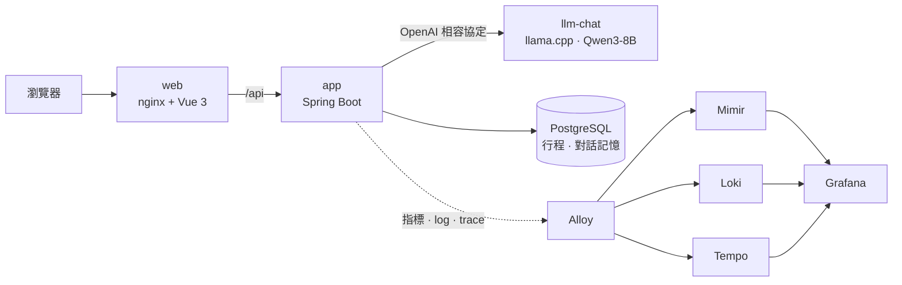

# talkcal

[](https://github.com/Anderson-chen/talkcal/actions/workflows/ci.yml)

用自然語言管行事曆的 AI 助理。跟它說「明天晚上七點和 Amy 吃飯」，它會提議一張行程卡片，你確認後才存；
也能問「這週末有空嗎？」「下週一早上有哪些空檔？」。模型自己架（llama.cpp + Qwen3-8B），不呼叫雲端 API。

這個 repo 是作品集。功能刻意只做一條主線，重點放在**一個產品上線後要顧慮的事**：
架構怎麼守、怎麼觀測、怎麼壓測、怎麼部署。

## 架構



AI 助理是自己寫的 agent loop：每一輪把對話歷史和三個工具交給模型，模型決定要不要呼叫工具，
工具背後是行事曆的 use case。

| 工具 | 做什麼 | 會不會存檔 |
|---|---|---|
| `propose_events` | 把一句話解析成行程，畫面上顯示確認卡片 | 不會：使用者按確認才送 `POST /api/calendar/events` |
| `list_events` | 查一段日期裡的行程 | 不會 |
| `find_free_slots` | 找一段日期、某個時段裡的空檔 | 不會 |

## 目錄

每個資料夾是一個關注點，各自有 README 說明設計理由：

```
backend/   Spring Boot app：程式碼、Gradle、Dockerfile
web/       Vue 3 前端：程式碼、npm、Dockerfile、nginx 設定
deploy/    把 app、前端、模型、資料庫跑起來的 Docker Compose
ops/       觀測：Alloy → Mimir / Loki / Tempo → Grafana
perf/      k6 壓測
ci/        CI 要檢查什麼、在什麼環境檢查
docs/      設計稿
```

## 程式結構

後端（`backend/`）是六角架構（Hexagonal / Ports & Adapters），目錄照 BuckPal 的慣例：

```
io.github.andersonchen.talkcal
├── Application            只負責啟動（留在根 package，元件掃描和測試都從這裡找起）
├── app                    組裝根，代表整個應用程式：業務模組不知道自己被怎麼組起來
│   ├── config             所有 @Configuration，唯一認識具體實作的地方
│   ├── job                排程工作（每天清舊對話）
│   └── observability      全站共用的 access log
└── calendar               行事曆這門業務，一個模組
    ├── application
    │   ├── domain.model     業務規則（CalendarEvent、FreeSlots…），純 Java，不認識 Spring
    │   ├── domain.service   use case 的實作，只呼叫 model 和 port
    │   ├── port.in          use case 介面（外面怎麼使喚核心）
    │   └── port.out         核心需要的外部能力（存取行程、抽行程）
    └── adapter
        ├── in               HTTP controller、AI 助理與它的工具
        └── out              PostgreSQL、Spring AI
```

分層規則寫成 [ArchitectureTest](backend/src/test/java/io/github/andersonchen/talkcal/ArchitectureTest.java)（ArchUnit）：
依賴只能由外往內、core 不准依賴 Spring 和 Jackson、只有組裝根（app.config、app.job）能認識 adapter 的具體類別、模組之間互不 import。違反就紅燈，不靠 code review 記得。

## 技術選型

| 層 | 用什麼 | 為什麼（細節在各目錄的 README 和程式碼註解） |
|---|---|---|
| 後端 | Java 25、Spring Boot 4.1、Spring MVC | |
| 跟模型講話 | Spring AI 2.0（OpenAI 相容協定） | llama-server 講 OpenAI 的協定；哪天換成雲端模型，改設定不改程式 |
| 模型 | llama.cpp + Qwen3-8B（Q4_K_M） | 自架：資料不出機器、沒有 token 費用 |
| 資料庫 | PostgreSQL 18 + Flyway，用 JdbcClient 不用 JPA | 只有兩張表，手寫 SQL 一眼看得懂，domain 物件不必為了 ORM 加註解 |
| 前端 | Vue 3 + TypeScript + Vite | 見 [web/README.md](web/README.md) |
| 觀測 | Grafana Alloy → Mimir / Loki / Tempo → Grafana | 指標、log、trace 三種訊號，互相點得過去。見 [ops/README.md](ops/README.md) |
| 壓測 | k6 | 見 [perf/README.md](perf/README.md) |
| 部署 | Docker Compose（在本機模擬雲端部署） | 見 [deploy/README.md](deploy/README.md) |

## 怎麼跑

需要：Docker（含 NVIDIA GPU 支援）、JDK 25。

> **已知限制**：模型檔目前從寫死的 `C:\llm\models` 複製進容器（`deploy/compose.yaml`），所以只能在 Windows 上照原樣跑。
> 要先把 `Qwen3-8B-Q4_K_M.gguf` 放進那個資料夾。改成可設定的路徑是待辦事項。

```bash
docker compose -f deploy/compose.yaml up -d postgres llm-chat   # 資料庫和模型（第一次要等模型複製、載入）
cd backend && ./gradlew deploy                                  # 跑測試、build 並部署 app 和前端
```

瀏覽器開 <http://localhost:18080>。API 文件（Swagger UI）在 <http://localhost:18090/swagger-ui.html>。

要看觀測：再起 `ops/`（`docker compose -f ops/compose.yaml up -d`），Grafana 在 <http://localhost:3000>。

本機開發（不進容器）：

```bash
cd backend && ./gradlew bootRun  # app 在 8090，連 deploy/ 的 PostgreSQL 和模型
npm --prefix web run dev         # 前端在 5173，/api 轉給 8090（在 repo 根目錄跑）
```

## 測試

Gradle 指令都在 `backend/` 裡跑：

```bash
./gradlew test               # 單元測試、web 切片、架構規則：不需要任何外部服務，秒回
./gradlew integrationTest    # 對真的 llama-server 和 PostgreSQL（Testcontainers）；模型沒開就自動跳過那幾支
../ci/run.sh                 # 跟 CI 完全一樣：在乾淨的容器裡跑上面全部，再加前端的型別檢查和打包
```

CI 在每次 push、PR 時於 GitHub 上跑，本機則由 pre-push hook 在推之前先跑一次（`git config core.hooksPath .githooks` 啟用）。
兩邊走同一支 `ci/run.sh`、同一個映像檔；GitHub 沒有 GPU，模型測試只在本機會真的跑。設計見 [ci/README.md](ci/README.md)。

## 文件地圖

| 想知道 | 看哪裡 |
|---|---|
| 怎麼部署、容器之間怎麼溝通、對照雲端是什麼 | [deploy/README.md](deploy/README.md) |
| 怎麼觀測、三種訊號怎麼互跳 | [ops/README.md](ops/README.md) |
| 怎麼壓測、怎麼讀結果 | [perf/README.md](perf/README.md) |
| CI 怎麼跑、為什麼在容器裡跑 | [ci/README.md](ci/README.md) |
| 前端怎麼組成 | [web/README.md](web/README.md) |
| 畫面設計稿和實作的差異 | [docs/design/calendar/README.md](docs/design/calendar/README.md) |
| 資料表為什麼長這樣 | [backend/src/main/resources/db/migration](backend/src/main/resources/db/migration)（每支 SQL 開頭都寫了理由） |
